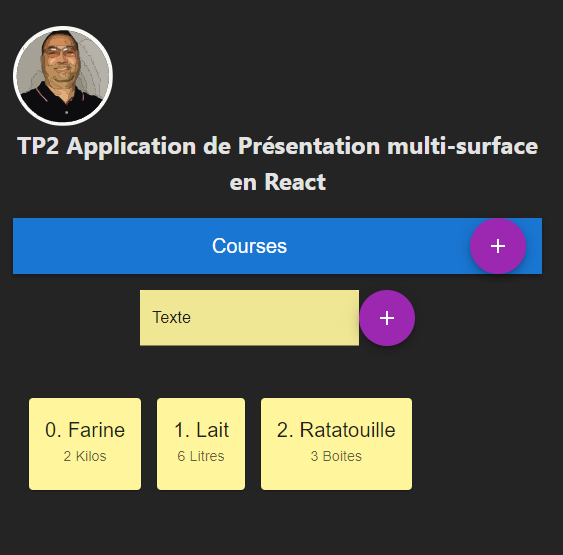

# Application de Présentation multi-surface en React et Vite  
## Requirements:  
``` $ npm install routes axios ```  
``` $ npm install @mui/material @emotion/react @emotion/styled ```  

## Preview:  
  
  
Currently, two official plugins are available:  

- [@vitejs/plugin-react](https://github.com/vitejs/vite-plugin-react/blob/main/packages/plugin-react/README.md) uses [Babel](https://babeljs.io/) for Fast Refresh
- [@vitejs/plugin-react-swc](https://github.com/vitejs/vite-plugin-react-swc) uses [SWC](https://swc.rs/) for Fast Refresh
